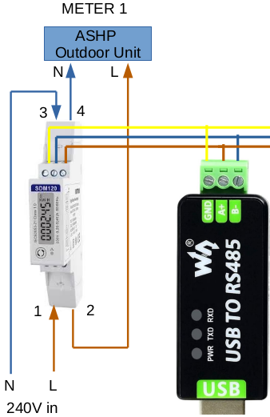

Pre-provisioned fully inclusive bundle for Level 3 Hybrid Heat Pump Monitoring

## Kit of parts

- emonHP web-connected data-logger
- 2x Heat meters: ASHP & Boiler
- 1x In-line electricity meter: ASHP
- 1x Clip-on CT electricity meter:  Grid 
- 1x Water Meter – DHW incoming cold main
- 1x Power supply: 5V USB-C

## 🔥 Heat Meter Installation 

* 🛠️ **Install on primary pipework** before any diverter valve, volumiser, or buffer.
* 🔥 **Install meter body** on the primary flow (hot) pipe.
* ➡️ **Observe direction** of the flow arrow on the meter body.
* 🛑 **Avoid close proximity** with other heat sources.
* 🌡️ **Install temperature sensor tee** on the primary return.
    * *Note:* Larger meters (DN25) do not have a temperature sensor in the body; these meters require two temperature sensor tees. These should be fitted close to the meter body, either before or after.
* 🗺️ **See manufacturer's guidance** on heat meter body installation location (figure3). Take care to install the heat meter in position 'A' or 'B' to avoid sources of turbulence. If the meter is installed horizontally (i.e., position 'A'), ensure the meter body is rotated to **45°**.
* 📉 **System Pressure:** Heat meters require a minimum of 1.2 bar (1.5 bar minimum is highly recommended).
* 🧼 **System Flushing:** Heat meters are highly susceptible to dirt. Ensure the system is properly flushed *before* connecting the heat meter.
* ⚡ **Power Supply:** Axioma heat meters require a mains 240V power supply (e.g., a 3A fused connection unit [FCU] or a dedicated feed from the heat pump controller).

 > ⚠️ **IMPORTANT:** Take care to purge all the air out of the system. Air trapped inside will result in incorrect readings.
 

### 🚰 Water Meter Installation

* 🔵 **Install the water meter** on the main cold supply to the combi boiler or DHW (Domestic Hot Water) tank.
* 📏 **Straight Pipe Runs:** There is no requirement for a straight pipe length before or after the meter.
* ➡️ **Observe direction** of the flow arrow stamped on the meter body.
* 🔄 **Orientation:** Install the meter in one of the approved orientations shown below in *Fig 4*.
* 🔌 **M-Bus Connection:** Connect the M-Bus data two-wire connection (see the wiring section below)

{width=40%}

### M-Bus Data Connections

The heat meters and water meters connect directly to the **emonHP** using an **M-Bus to USB adapter**.

* 🧬 **Polarity Irrelevant:** M-Bus is a two-wire bus system where polarity does not matter. The meter connections can be wired to **M+** and **M-** in either orientation.
* ⛓️ **Daisy-Chaining:** Multiple meters can be connected to the same M-Bus line. You can use Wago connectors to daisy-chain the meters together in parallel
* 🧵 **Cable Type:** For short runs, standard 2-core flexible cable can be used. For long runs, we highly recommend using twisted-pair, non-shielded cable (minimum $0.5\text{ mm}^2$).
* ⚠️ M-Bus data cables should be physically separated from mains 240V AC power cables by a **minimum of 5cm** to prevent signal interference and cross-talk.

### ⚡ Electricity Meter Installation

* 🌡️ **1st Electricity Meter (SDM120):** This meter must be installed **in-line** on the electrical circuit directly feeding the ASHP (Air Source Heat Pump).
    * 🔧 **Torque Spec:** The power terminals must be torqued precisely to **1.5 Nm**.
* 🏠 **2nd Electricity Meter (SDM120CT):** This meter is used to monitor the main grid supply to the property via a clip-on CT (Current Transformer) sensor.
    * ➡️ **CT Orientation:** Ensure the arrow printed on the CT sensor points **towards the house (load) side**.
* 🔌 **Power Supply:** The meter requires a stable **240V AC supply**.

---

### 🌐 Modbus Data Connections

* 💻 **Adapter Connection:** The **USB > RS485 Modbus adapter** should be plugged into the **emonHP** using the supplied USB extension cable.
* 🧵 **Cabling Specifications:** For short runs, standard 3-core flexible cable can be used. For long runs, we highly recommend using shielded cable, such as Cat5 shielded (minimum $0.2\text{ mm}^2$).
* ⚠️ The Modbus data cable run must be physically separated from mains 240V power cables by a **minimum of 5cm** to avoid data corruption and electrical interference.

---

***

## Getting Started
Before plugging in the device, ensure you have read the safety instructions.

| Step | Action | Expected Result |
|------|--------|-----------------|
| 1    | Plug in | Power LED turns blue |
| 2    | Press Start | Screen initializes |

# Advanced Configuration
This section covers advanced tweaks...
sdsdf