*Pre-provisioned fully inclusive bundle for level 3 hybrid heat pump monitoring, hot water consumption and whole house electric consumption monitoring using independent MID approved meters.*

☎️ Phone / **WhatsApp**: +44(0)1286 800870  
✉️ Email: support@openenergymonitor.zendesk.com  | 🌐 OpenEnergyMonitor.org 

# Parts List

- emonHP web-connected data-logger
- 2x Heat meters: ASHP & Boiler
- 1x In-line electricity meter: ASHP
- 1x Clip-on CT electricity meter:  Grid (whole house consumption)
- 1x Water Meter – DHW cold feed
- 1x Wireless indoor temperature sensor
- 1x Power supply: 5V USB-C

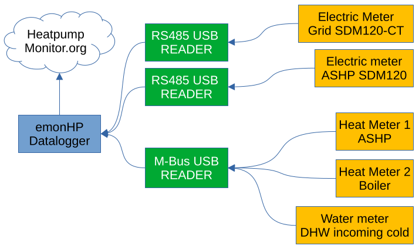{width=80%}

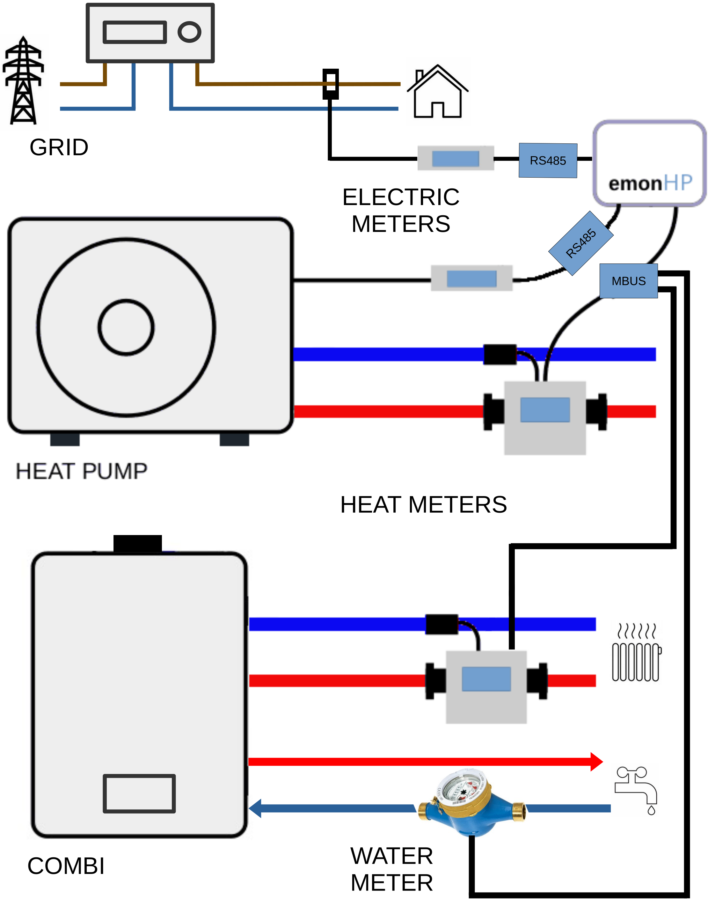{width=80%}

# ♨️ Heat Meter Installation 

* 🛠️ **Install on primary pipework** before any diverter valve, volumiser, or buffer.
* 🔥 **Install meter body** on the **primary flow** (hot) pipe.
* ➡️ **Observe direction** of the flow arrow on the meter body.
* ❄️ **Install temperature sensor tee** on the **primary return** (cold) pipe.
    * *Note:* Larger meters (DN25) do not have a temperature sensor in the body; these meters require two temperature sensor tees. These should be fitted close to the meter body, either upstream or downstream.
* 🛑 **Avoid close proximity** with other heat sources.
* 🗺️ **See manufacturer's guidance** on heat meter body installation location (figure3). Take care to install the heat meter in position 'A' or 'B' to avoid sources of turbulence. If the meter is installed horizontally (i.e., position 'A'), ensure the meter body is rotated to **45°**.
* 📉 **System Pressure:** Minimum 1.2 bar (1.5 bar minimum recommended).
* 🧼 **System Flushing:** Ensure the system is properly flushed *before* connecting the heat meter.
* ⚡ **Power Supply:** Axioma meters require a mains 240V power supply e.g. 3A fused spur / plug-top or a feed from the heat pump controller.

 > ⚠️ **IMPORTANT:** Take care to purge all the air out of the system. Air trapped inside will result in incorrect reading, see Appendix A.
 
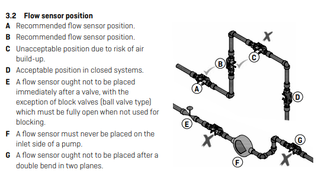

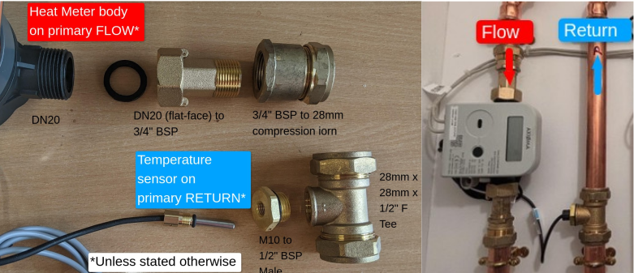

# 🚿 Water Meter Installation (DHW)

* 🛠️ **Install the water meter** on the **cold supply** to the combi boiler or DHW (domestic hot water) tank.
* ➡️ **Observe direction** of the flow arrow stamped on the meter body.
* 🪱 **No straight pipe required:** There is no requirement for a straight pipe length before or after the meter.
* 🔄 **Orientation:** Install the meter in one of the approved orientations shown below:

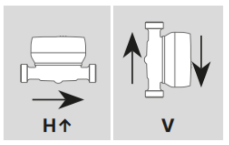{width=30%}

* 🔌 **M-Bus Connection:** Connect the M-Bus data two-wire connection (see the wiring section below)

# 🔌 M-Bus Data Wiring

* 💻 **Adapter Connection:** The heat meters and water meter connect to the **emonHP** datalogger using an **M-Bus to USB adapter**.
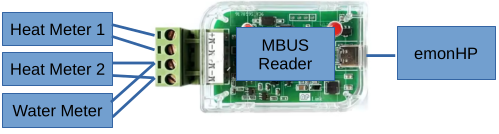

* 🧬 **Polarity Irrelevant:** M-Bus is a two-wire bus system where polarity does not matter. The meter connections can be wired to **M+** and **M-** in either orientation.
* ⛓️ **Daisy-Chaining:** Multiple meters can be connected to the same M-Bus line. You can use Wago connectors to daisy-chain the meters together in parallel.
* 🧵 **Cable Type:** For short runs, standard 2-core flex cable can be used. For longer runs, we highly recommend using twisted-pair, non-shielded cable e.g CAT5.
* ⚠️ M-Bus data cables should be physically separated from mains 240V AC power cables by a **minimum of 50mm** when running in parallel to prevent interference.

# ⚡ Electricity Meter Installation

* 🥇 **1st Electricity Meter (SDM120):** This meter must be installed **in-line** on the electrical circuit directly feeding the ASHP (Air Source Heat Pump).
    * 🔧 **Torque Spec:** The power terminals must be torqued to **1.5 Nm**.
    * 🔌 **Wiring Diagram:** See below.

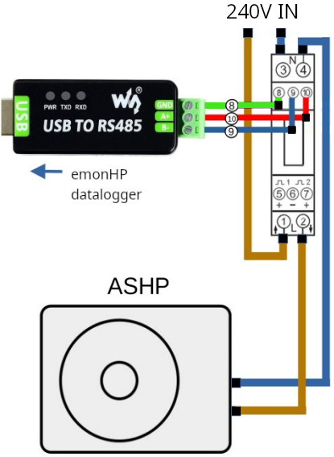{width=48%}

* 🏠 **2nd Electricity Meter (SDM120CT):** This meter is used to monitor the main grid supply to the property via a clip-on CT (Current Transformer) sensor.
    * 🟫 **Live Conductor:** The CT must be clipped around only the Live meter tail after the utility meter, before any Henley blocks. 
    * ➡️ **CT Orientation:** Ensure the arrow printed on the CT sensor points **towards the house (load) side**.
    * ⚡ **Power Supply:** The SDM120CT meter requires a **240V supply** e.g fused spur or low rated circuit breaker: 
        * 🟦 **Neutral:** Terminal 3
        * 🟫 **Live:** Terminal 4

 > ⚠️ **IMPORTANT:** Electric meters require suitable DIN enclosures 

# 🌐 Modbus (RS485) Data Wiring

* 💻 **Adapter Connection:** The **RS485 Modbus to USB adapter** should be plugged into the **emonHP** using the supplied USB extension cable.
* 🔌 **Wiring:** See Fig 7 above
* 🧵 **Cabling Specifications:** For short runs, 3-core flexible cable can be used. For long runs, we recommend using shielded cable, such as CAT5 shielded.
* ⚠️ **Mains separation**: The Modbus data cable should be physically separated from 240V AC power cables by a **minimum of 50mm** when running parallel to avoid data corruption and electrical interference.

# 🌡️Wireless Indoor Temperature Sensor  

The **emonTH** wireless indoor sensor transmits temperature data to the emonHP via low-power 433Mhz RF.

- 🔋 **Insert batteries:** 2x AA supplied 
- 🔄 **Automatic pairing:** The sensor is pre-paired with the emonHP base-station 
- 🏠 **Location:** Place sensor in the main living space e.g. living room 
- 🛜 **RF Range:** Ensure sensor is no more than 50m away from emonHP base-station

# 🖥️ emonHP Data Logger

The emonHP reads data from the meters and logs it securely to a cloud server. It is essential that the emonHP has a reliable internet connection. **Whenever possible, we highly recommend a wired Ethernet connection.** Using Ethernet makes the installation plug-and-play. 

## 🚀 Standard Installation (Wired)

1. 🔌 **Connect Meters:** Plug the USB meter readers into any of 4x USB ports on the unit.
2. 🌐 **Connect Network:** Plug in RJ45 Ethernet cable.
3. 🛜 **Attach Antenna:** This is used to receive RF data from the indoor temperature sensor. 
4. ⚡ **Power On:** Plug in and switch on the supplied 5V USB-C power supply.

##  📶 Wi-Fi Operation

⚠️ **NOT RECOMMENDED:** Customers often change their router and forget to re-connect the monitor, which results in data-loss.

1. 📱 **Connect to the Access Point:** On your smartphone, connect to Wi-Fi Access Point (AP) **`emonPi`** with password **`emonpi2016`**.

> 💡 Note: **The Wi-Fi AP is present for 10min after power-up:** Re-enable the AP by pressing the button on the emonHP until **“Enable WiFi AP”** is displayed on the LCD. Then, press and hold the button (see Fig 9).

2. 🗺️ **Access the Interface:** Once connected, a captive portal window should automatically appear, displaying the Wi-Fi configuration interface.

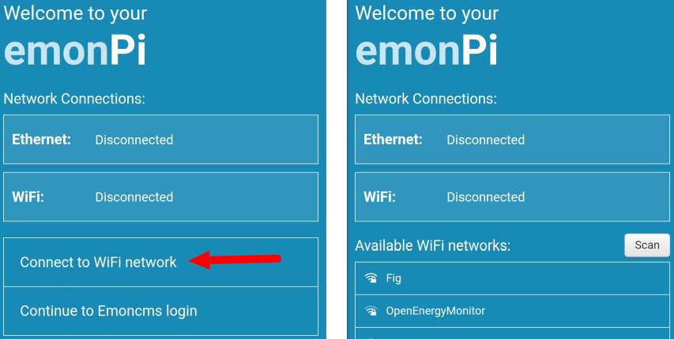{width=70%}

3. 🔑 **Connect:** Select **“Connect to WiFi network”**, select network name, enter the password, tap **‘Connect’**.
4. 🔒 **Verify Connection:** After a few moments, the screen will display **‘Connected’**. You can also verify the live Wi-Fi status on the emonHP hardware LCD screen by using the top button to scroll through the information pages:

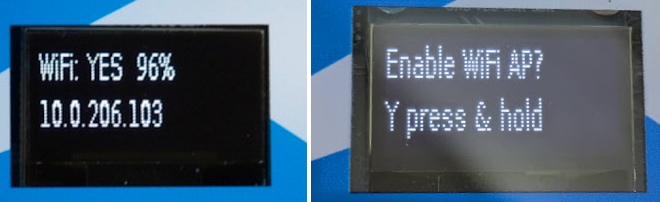{width=60%}

####  📶🔄 WiFi Reconfiguration

If the  Wi-Fi network settings have changed (e.g. after installing a new router), you must reconfigure the emonHP Wi-Fi connection to connect to the new network. Alternatively a Powerline Ethernet extender can be used to provide a reliable wired Ethernet connection without running a cable: https://shop.openenergymonitor.com/powerline-ethernet-extender

1. **Enable Wi-Fi AP**: Press the button on the front of the emonHP unit repeatedly until the message "Enable Wi-Fi AP" is displayed on the LCD. Once the message is displayed, press and hold the button for 5 seconds to activate the access point mode.
2. **Connect to Wi-Fi AP**: Using a smartphone, tablet, or computer, search for available Wi-Fi networks. Connect to the network named **emonPi** and when prompted, enter the password: **emonpi2016**.
3. **Emoncms Login:** Once connected, the captive portal should bring up the Network status interface. Tap **"Continue to Emoncms Login"**.
    - Login with credentials: Username: **"emonhp"**, Password: **"emonhp"**
4. **Network Settings:** Navigate to the Network menu on left-hand sidebar and select **"Connect to WiFi network"**.
5. **Select Network:** Select new network name, enter the passkey and then click **"Connect"**. 
6. **Check status:** After a few moments it should display **"Connected"**, the WiFi connection status is also shown on the LCD display on the front of the emonHP, use the push button to scroll through the info pages until it shows the WiFi status. See Fig 8 above.  
  

# ✅ Commissioning Checklist  

Before leaving site, check the following:

| Step | Check | Expected Result | Tick?
|-|--------|-----------------|-----|
| 1    | emonHP is connected to **Ethernet (recommended)** OR WiFi | {width=80%} | YES? ☐ If using WiFi signal should be > 40% ☐|
| 2    | Data from **ASHP heat meter 1**| {width=40%}| Updating every 10s? ☐ |
| 3    | Data from **ASHP electric meter** | {width=40%}| Updating every 10s? ☐ |
| 4    | Data from **boiler heat meter 2**| {width=40%} | Updating every 10s? ☐ |
| 5    | Data from **grid Meter** Clip-on CT (whole house) | {width=40%} | Updating every 10s? ☐ |
| 6    | Data from **wireless indoor temperature sensor** | 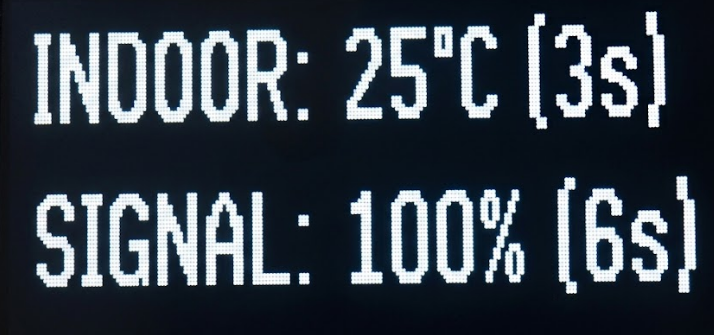{width=40%} | Updating every 60s? ☐  Signal>30% ☐ | 
| 7    | Data from **water Meter** (DHW) | {width=40%} | Updating every 10s? ☐ |
| 8    | Check **cloud server connection** | {width=40%} |  Updating every 10s? ☐ |
| 9   | Scan **QR code**   | Scanning the QR code on the emonHP should show the monitoring dashboard   | Is dashboard data live? ☐ |
| 10    | Take **photos**   | Showing installation as a whole, position of heat meters outdoor unit & pipework  | ☐ |

# 📕 Appendix A: Removing Air

*Removing trapped and dissolved air from a sealed heating system is essential for maintaining efficiency, ensuring accurate heat meter readings, and prolonging the system's lifespan by minimizing corrosion.*

Ultrasonic heat meters, such as Kamstrup, Axioma, and Sharky, are unable to measure flow rates accurately if there is air in the system. This can cause the flow rate to be reported as zero, resulting in the heat meter showing no heat being measured. This issue is most likely to occur towards the end of a Domestic Hot Water (DHW) cycle when the flow temperature is highest:

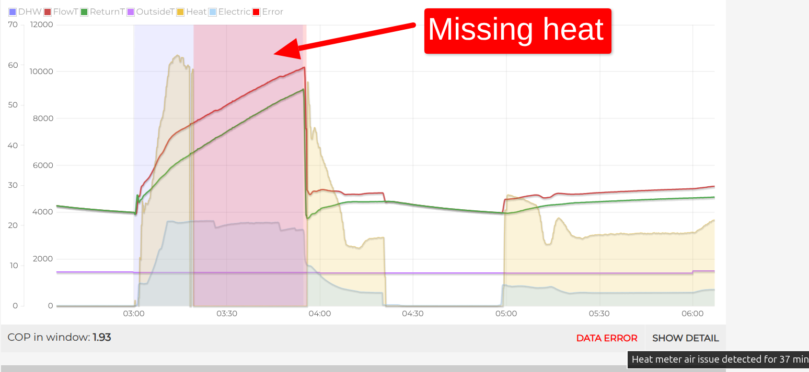

**During Design / Installation**

To maximize the effectiveness of air removal:

- **Install Automatic Air Vents (AAVs):** Place AAVs at the highest points of the primary pipework on the flow, return, and domestic hot water (DHW) coil.
- **Fit a Deaerator:** Install a deaerator such as a Spirovent on the primary flow line, ideally before the circulator pump.
- **Avoid Dead Legs:** Design pipework to eliminate dead legs and avoid creating areas where air could become trapped.

**During Commissioning**

Follow these steps to ensure all air is effectively purged from the system:

1. **Fill the System:** Use the filling loop to fill the system, keeping all AAVs open and bleed all radiators.
2. **Increase System Pressure:** Raise and maintain the system pressure as high as possible, ideally up to 2.8 bar. This will compress air pockets into the smallest possible space.
3. **Enable the Circulator Pump Air Purge/Vent Cycle:**
   - Engage the purge cycle (if available) to pulse the circulator pump, helping move trapped air pockets through the system. This option is usually found on the circulator pump itself or on the heat pump controller.
   - If an automatic purge cycle isn't available, manually switch the pump to maximum power, then off repeatedly to achieve a similar effect.
4. **Open All Valves:** Ensure all radiator valves are fully open and switch the diverter valve between space heating and DHW modes.
5. **Bleed Radiators Again:** Keep the AAVs open and bleed the radiators again during this process; top up pressure if required to maintain a high pressure, ideally 2.8 bar.
6. **Purge by Zones:** If dealing with a large system or suboptimal pipe layout (e.g., ceiling drops, loops), consider purging each zone or radiator leg individually to increase flow velocity through the system.
7. **Conduct a Low Pressure 'Cook-Off':**
   - **Reduce Pressure:** Lower system pressure to 0.7 bar; water under lower pressure can dissolve less gas.
   - **Heat the System:** Set the heat pump to its maximum output to raise the system's temperature as high as possible. Hot liquids dissolve less gas.
   - **Run for 1 Hour:** Operate the system at maximum temperature for about an hour with AAVs open.
   - **Restore Working Pressure:** Top the pressure back up to the normal working range of 1.5-2 bar.

**After Commissioning**

- **Close the AAVs:** Once commissioning is complete, close the AAVs.
- **Customer Advice:** Advise the customer to periodically open the AAVs and attempt to bleed the highest radiators during the first few months of operation to ensure any residual air is removed.

**Air Troubleshooting**

- **Consider filling with demineralised water:** Ensure the correct pH for your system. This has lower conductivity and will prevent hydrogen release. See: [Heating Water Treatment Explained (VDI 2035)](https://www.heatgeek.com/heating-water-treatment-explained-vdi-2035).

# 📗 Appendix B: Annotated Manufacturer Schematics

#### Alpha

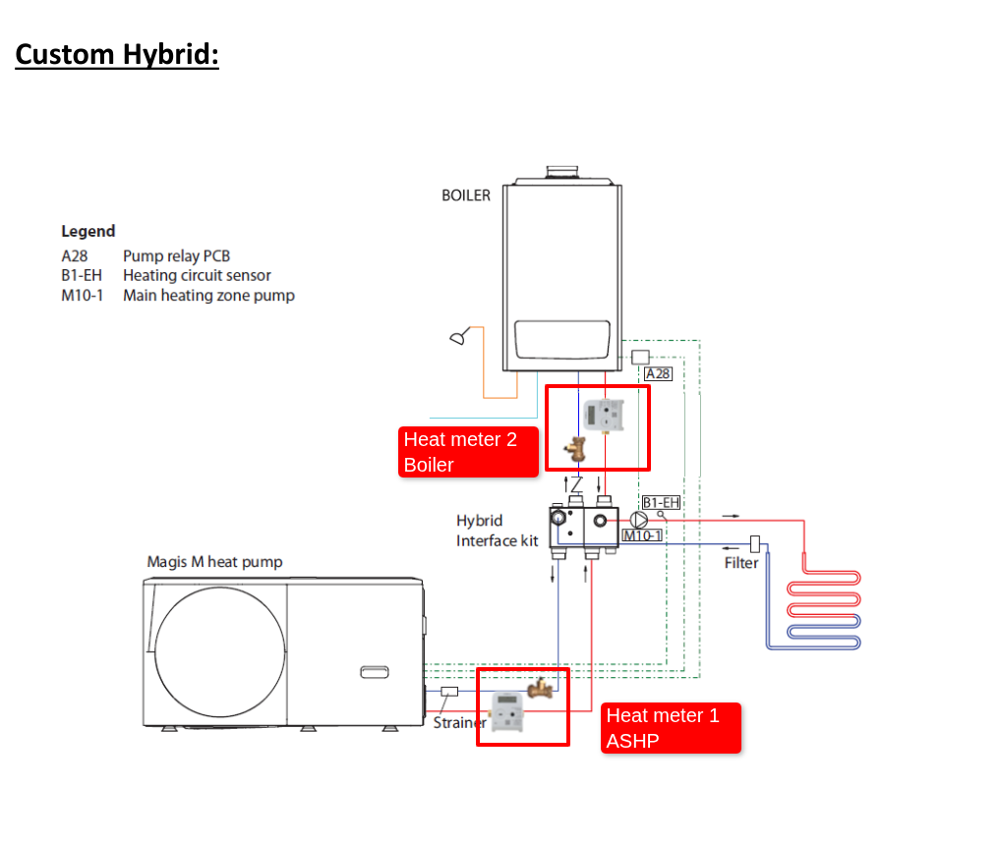

#### Warmflow

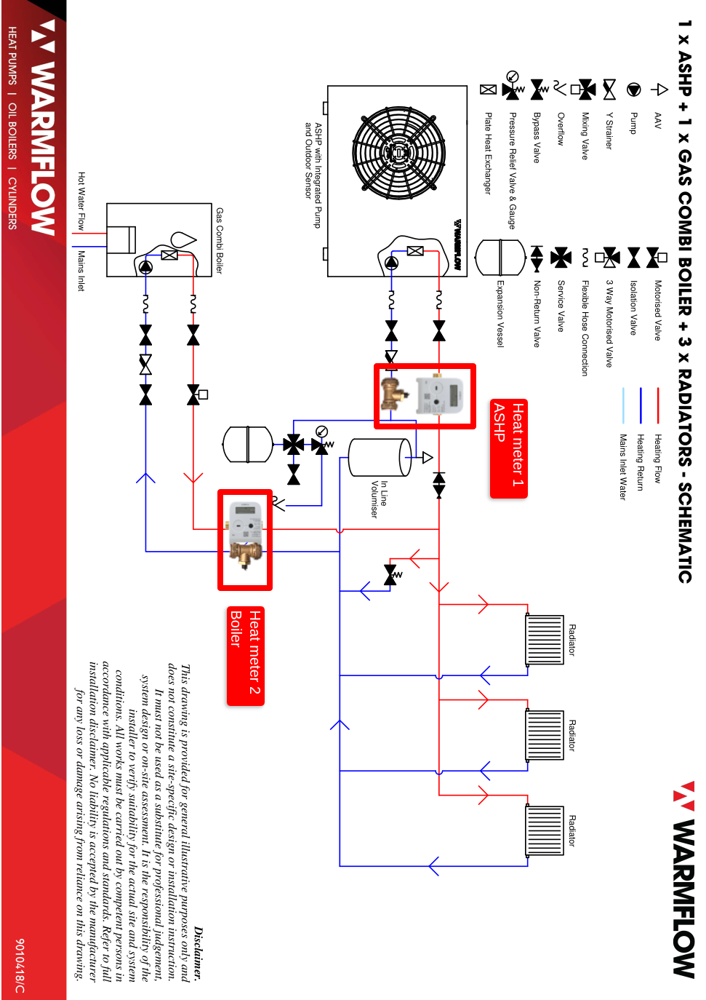

#### Vaillant

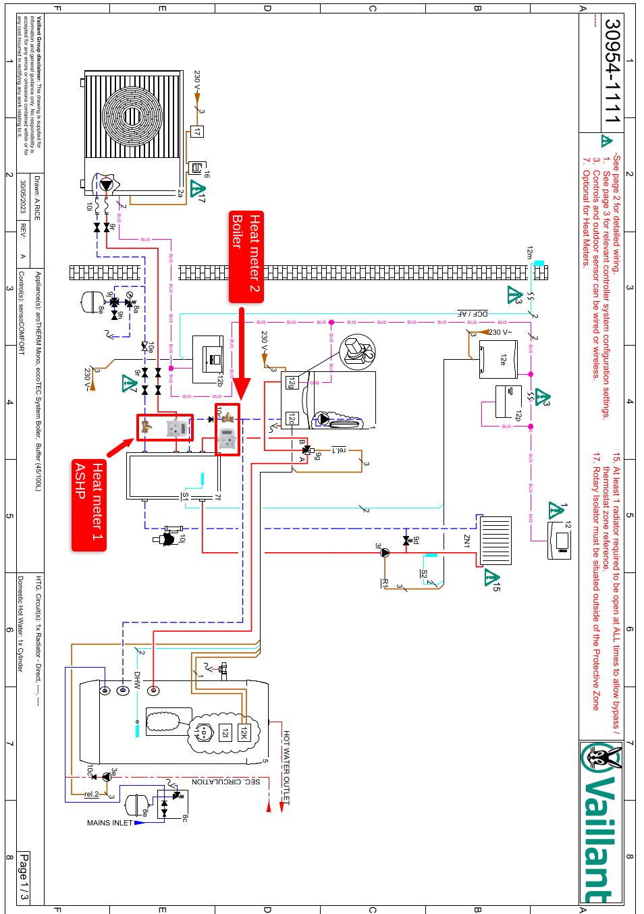

